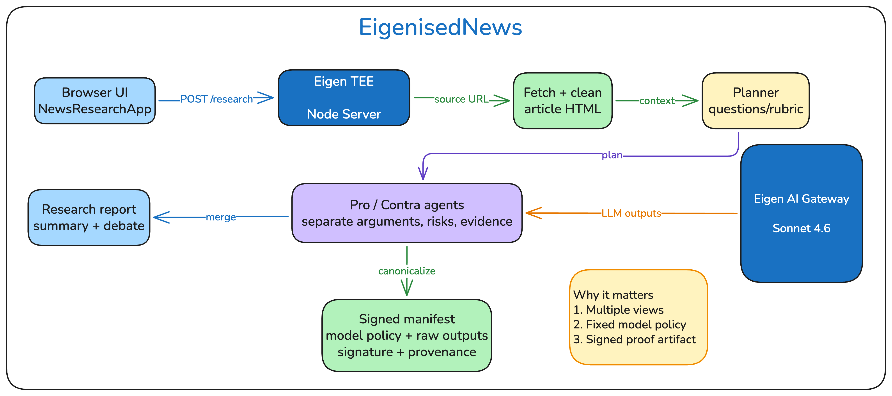

# eigenisedNews

eigenisedNews is a research product for interrogating a single news article from both sides.



Its primary workflow accepts one article URL, fetches that article once, prepares a shared article context, asks a main agent to create two research prompts, runs pro and contra analyses over the same source material, then has the main agent summarize where those takes align or diverge. The repo also keeps a secondary operator workflow: a signed multi-model synthesis console that produces a verifiable manifest over a fixed model set.

## What the product does

- **Primary mode: article research.** Submit one news article URL and get two evidence-backed perspectives on the same article, plus a quick main-agent synthesis of where the pro/contra verdicts agree or split.
- **Paid agent API.** Agents can call the same research workflow through `POST /api/research`, pay per request with x402 or MPP via `dual402`, and discover the route through OpenAPI/x402 metadata.
- **Secondary mode: signed synthesis.** Submit a topic plus URLs and/or pasted source text, fan the request out to the fixed model set, and receive a signed consensus manifest.
- **Verifier support.** Saved `/synthesize` responses can be replayed and checked offline, with optional URL refetch and EigenCompute provenance evidence.

Read the deeper docs here:

- [Product guide](docs/product.md)
- [Architecture guide](docs/architecture.md)
- [EigenCloud / EigenCompute guide](docs/eigencloud.md)
- [Verifier runbook](docs/verifier.md)
- [LLM proxy notes](docs/llm-proxy-notes.md)

## Product surfaces

### 1. Article research (`POST /research`, `POST /research/jobs`)

This is the default UI and the main product story.

```bash
curl http://localhost:3000/research \
  -H 'content-type: application/json' \
  -d '{"articleUrl":"https://example.com/news/story"}'
```

The response includes article metadata, the pro/contra prompts derived from the article, both analyses, the main-agent comparison summary, clean request/error metadata, and agent run diagnostics. It also returns `promptBindings` (the visible system prompt for each main planner/pro/contra/main-summary stage, system-prompt hash, and full prompt hash) plus `verifiableBuild` metadata (`appId`, `imageDigest`, `commitSha`, dashboard URL, and prompt source path) so a reviewer can connect each perspective to the deployed EigenCompute build.

`/research` responses are signed and verifier-compatible. Raw audit payloads are omitted by default; request `?include=raw` when you want the planner/pro/contra/summary raw outputs and exact prompts included for strict replay checks.

Successful research reports are persisted server-side. On EigenCompute the store uses the platform persistent data mount (`USER_PERSISTENT_DATA_PATH`, normally `/mnt/disks/userdata`) under `eigenised-news/research-reports`; local development falls back to `.data/eigenised-news/research-reports` unless `RESEARCH_STORAGE_DIR` is set. Duplicate article links are normalized and reuse the saved report instead of rerunning the agents.

For background submissions, use the queue API one article at a time. This lets the browser keep one report in progress while the user pastes another URL and adds it to the side queue; completed jobs stay clickable in the queue rail and open in the main results pane. Jobs run with concurrency `1` by default so long research calls provide immediate feedback without racing the Eigen gateway path:

```bash
curl http://localhost:3000/research/jobs?include=raw \
  -H 'content-type: application/json' \
  -d '{"articleUrl":"https://example.com/news/second"}'

curl http://localhost:3000/research/jobs/<job-id>
```

The API still accepts `articleUrls` for compatibility, but the product UI is optimized for incremental single-article enqueueing. Set `RESEARCH_QUEUE_STORE_PATH` to persist queue state to a JSON file. Successful queued reports are also saved to the normal persistent research history when the report store is available.

When `FIRECRAWL_API_KEY` is configured, article fetching uses Firecrawl `/v2/scrape` first for clean markdown content. If Firecrawl is unavailable or returns no usable content, the fetcher falls back to the existing bounded direct HTTP request. Without `FIRECRAWL_API_KEY`, direct HTTP remains the only fetch path.

### 2. Paid agent research (`POST /api/research`)

`/api/research` runs the same signed research workflow as `/research`, but it is guarded by [`dual402`](https://www.npmjs.com/package/dual402) so autonomous agents can pay per call with either x402 (Base USDC) or MPP (Tempo USDC).

```bash
curl -i http://localhost:3000/api/research \
  -H 'content-type: application/json' \
  -d '{"articleUrl":"https://example.com/news/story"}'
```

The first unpaid request returns `402 Payment Required` with both `PAYMENT-REQUIRED` and `WWW-Authenticate` challenges. A compliant x402 or MPP client pays, then retries the same request body to receive the normal research response.

Agent-facing support routes:

- `GET /openapi.json` — OpenAPI 3.1 description with payment metadata.
- `GET /.well-known/x402` — x402 resource discovery.
- `GET /verify` — user-readable verification guide plus EigenCompute deployment, payee, facilitator, and discovery metadata without secrets.
- `POST/GET /research/jobs` and `GET /research/jobs/{id}` — incremental queued article research.
- `GET /research/history` and `GET /research/history/{id}` — persistent saved research report index/detail for browser history and duplicate reuse.
- `GET /skill.md` — external agent skill for setup and endpoint usage.

Local/dev defaults keep the paid route in `auto` mode: it is mounted only when payment environment variables are complete. Set `PAID_RESEARCH_ENABLED=true` in production to fail closed if x402/MPP config is incomplete.

Required payment env vars are documented in `.env.example`; the short list is:

- `RECIPIENT_WALLET` or both `X402_PAYEE_ADDRESS` and `MPP_RECIPIENT`
- `MPP_SECRET_KEY`
- `USDC_TEMPO`
- `X402_NETWORK`
- `X402_FACILITATOR_URL`
- `CDP_API_KEY_ID` and `CDP_API_KEY_SECRET` for Base mainnet with the CDP facilitator
- `BASE_URL` when the service is behind a proxy or custom domain

### 3. Signed synthesis (`POST /synthesize`)

This is the secondary operator-facing flow. It accepts a topic plus URLs and/or pasted source text, runs the fixed model set, merges claims deterministically, and signs the resulting manifest.

Raw model outputs are omitted by default. Request `?include=raw` when you want strict verifier replay to pass.

## Quick start (local)

Use Node 25 for local, CI, and container parity.

```bash
npm install
cp .env.example .env
# then replace AGENT_PRIVATE_KEY in .env with a real 32-byte hex key
npm run dev
curl http://localhost:3000/healthz
```

For local signing, set `AGENT_PRIVATE_KEY` in `.env`. In EigenCompute, the app can derive its runtime signer from the platform-injected `MNEMONIC` instead.

To enable Firecrawl as the primary article-access fetcher, set `FIRECRAWL_API_KEY` in `.env` or the deployment environment. `FIRECRAWL_API_URL` is optional and defaults to the hosted Firecrawl API.

## Frontend to remote backend

To run the local frontend against a deployed backend:

```bash
FRONTEND_API_BASE_URL=http://<backend-host>:3000 npm run dev
```

When `FRONTEND_API_BASE_URL` is unset, the UI uses same-origin `/research` and `/synthesize` requests. If you point the local UI at a remote backend, that backend must allow the browser origins via `CORS_ALLOW_ORIGINS`.

## Trust and verification summary

The `/synthesize` path is built for replayable verification. The app records request and input hashes, per-model prompt hashes and outcomes, deterministic merge results, deployment metadata, and a signature over the manifest hash. The standalone verifier can then check integrity, signature recovery, raw output consistency, merge replay, refetch drift, and optional EigenCompute provenance.

The `/research` and paid `/api/research` paths produce a signed research manifest. It records the article URL/content hash, main/pro/contra/summary prompt hashes, output hashes, main-agent summary hash, deployment metadata, and a signature over the research manifest hash. With `?include=raw`, the verifier can also check the exact planner/pro/contra/summary prompts and raw outputs.

The browser UI includes a **Verification guide** card that explains what the proof does and does not mean, runs an in-browser **Verify this result** check through `POST /verify`, makes the EigenCloud build link visually distinct, and shows the exact agent prompts when raw audit data is included. The default reader UX does not require a terminal command or file download. It also includes a **Previous researched articles** library backed by the persistent report store so users can click a saved article and read the prior report directly.

Advanced operators can still use the verifier CLI directly:

```bash
npx tsx scripts/verify-manifest.ts response.json
```

Use strict verification when you also have raw outputs and provenance-capable evidence:

```bash
npx tsx scripts/verify-manifest.ts response.json --refetch --ecloud --strict
```

Strict mode fails on skipped checks as well as corrupted ones. In practice, local manifests and text-only synthesis requests are not enough for a full strict pass unless every required online/provenance check is also runnable.

See the [verifier runbook](docs/verifier.md) for the exact checks and failure modes.

## Deploy on EigenCompute

This repo ships an `eigencompute.yaml` for EigenCompute deployment and uses EigenCloud-compatible gateway routing for model calls. The short version is:

```bash
npm i -g @layr-labs/ecloud-cli@0.5.0
ecloud compute env set mainnet-alpha
```

For the platform details, app wallet behavior, gateway usage, and live smoke flow, see the [EigenCloud / EigenCompute guide](docs/eigencloud.md).

## Live smoke against a deployed app

```bash
APP_URL=http://<public-ip>:3000 npm run e2e:live
```

The smoke check verifies:

- `GET /healthz`
- `GET /` frontend shell
- `POST /synthesize?include=raw`
- signed manifest output with `thresholdMet=true`

## Current scope

What already exists:

- article-research-first browser UI
- persistent research history with duplicate URL reuse
- signed synthesis operator console
- standalone verifier CLI
- EigenCompute deployment config

What is still out of scope:

- on-chain commit of `manifestSha256`
- scheduled / cron synthesis
- streaming responses
- EIP-712 typed-data signatures
- request authentication / rate limiting

---

Deck: https://pitch.com/v/eigenised-news-eu3czs
